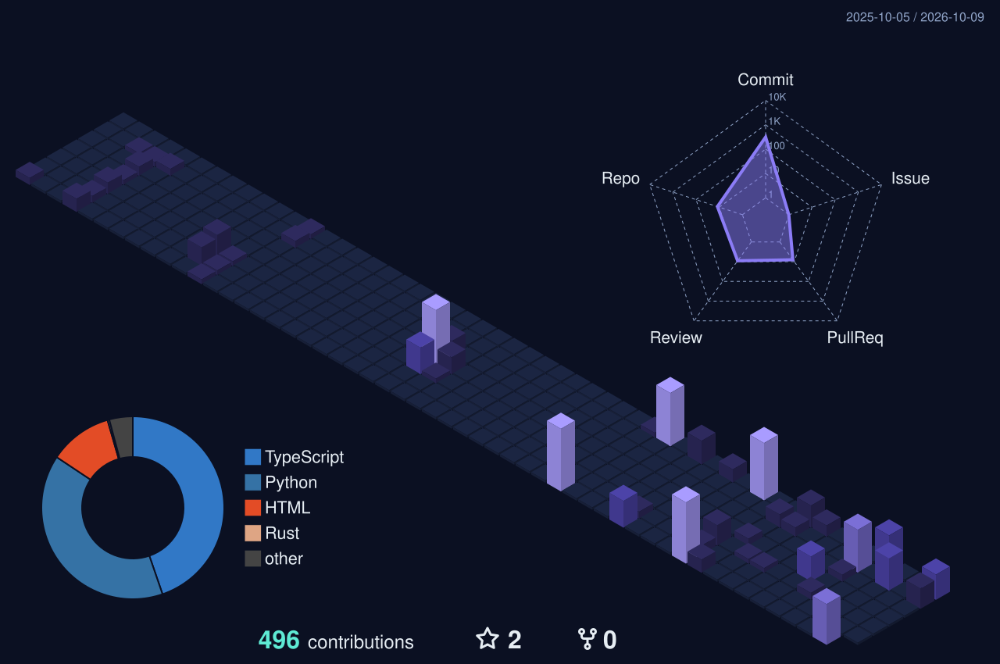

   

 

  

 

> **Architect of resilient, cloud-native systems.** I design and orchestrate large-scale distributed systems across AWS, Azure and GCP — containers, infrastructure automation, CI/CD and observability-driven architecture. I build infrastructure that engineers actually *enjoy* working with.

## ⚡ Mission Control

<table>
  <tr>
    <td width="33%" valign="top"><h3>🏗️ Design</h3>Scalable, resilient cloud architecture across AWS, Azure &amp; GCP.</td>
    <td width="33%" valign="top"><h3>🐳 Orchestrate</h3>Containerized workloads at scale with Kubernetes &amp; Helm.</td>
    <td width="33%" valign="top"><h3>📝 Codify</h3>Everything as code with Terraform &amp; Ansible — no snowflake servers.</td>
  </tr>
  <tr>
    <td valign="top"><h3>🔄 Automate</h3>CI/CD pipelines that make shipping boring (in the best way).</td>
    <td valign="top"><h3>📊 Observe</h3>Metrics, logs &amp; traces wired into actionable dashboards.</td>
    <td valign="top"><h3>🚀 Optimize</h3>Cost and performance tuning across cloud providers.</td>
  </tr>
</table>

## 🛠️ Stack Topology

<table>
  <tr><td><b>☁️ Cloud</b></td><td></td></tr>
  <tr><td><b>🐳 Containers</b></td><td></td></tr>
  <tr><td><b>📝 IaC</b></td><td></td></tr>
  <tr><td><b>🔄 CI/CD</b></td><td></td></tr>
  <tr><td><b>🐍 Languages</b></td><td></td></tr>
  <tr><td><b>📊 Observability</b></td><td></td></tr>
  <tr><td><b>🗄️ Data</b></td><td></td></tr>
  <tr><td><b>🖥️ Infra</b></td><td></td></tr>
  <tr><td><b>🤖 ML</b></td><td></td></tr>
</table>

## 📡 Live Telemetry

<picture>
  <source media="(prefers-color-scheme: dark)" srcset="https://raw.githubusercontent.com/KrishnaVaibhav/KrishnaVaibhav/output/github-snake-dark.svg"/>
  <source media="(prefers-color-scheme: light)" srcset="https://raw.githubusercontent.com/KrishnaVaibhav/KrishnaVaibhav/output/github-snake.svg"/>
  
</picture>

## 📚 Certifications

